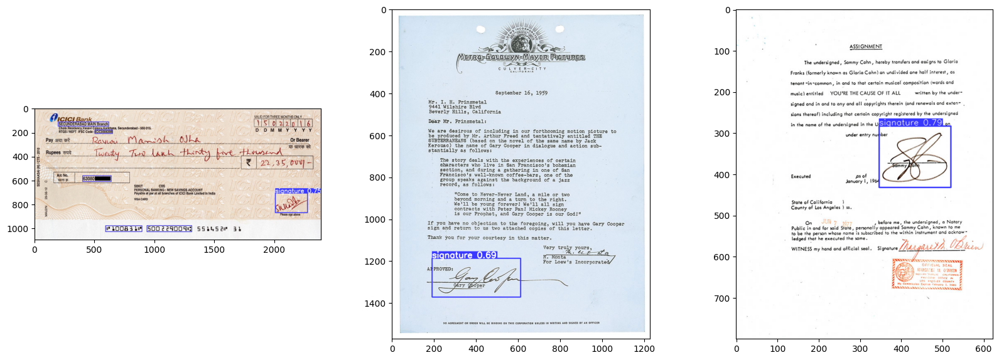
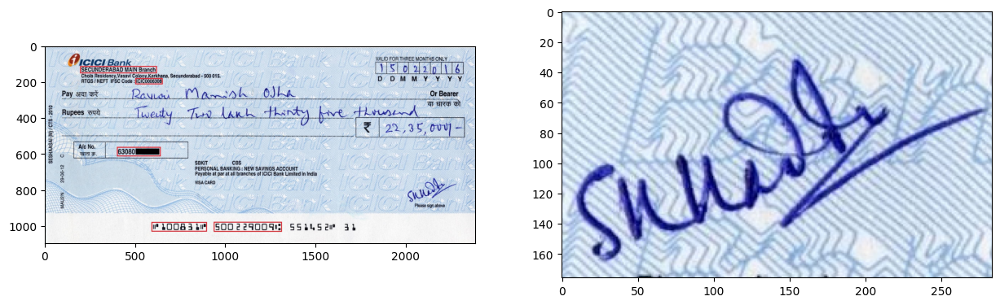

# Hand Signature Extraction (fine-tuned YOLO v8n)

.jpeg)


## Table of Contents

- [Project Overview](#project-overview)
- [Training Details](#Training-details)
- [Setup and Installation](#setup-and-installation)
- [Usage](#usage)
- [API Endpoints](#api-endpoints)
- [Results](#results)
- [Contributing](#contributing)
- [License](#license)

## Project Overview

This project implements a fine-tuned YOLO v8 nano model for detecting and cropping hand signatures from images. The model is trained on multiple hand-signature datasets, containing diverse hand signature samples, allowing it to accurately detect and extract signatures from complex backgrounds, deployed as a FastAPI application, and containerized with Docker.

### Key Features

- Fine-tuned YOLO v8 nano model for hand signature detection
- FastAPI-based REST API for easy integration
- Docker containerization for simplified deployment
- Automatic signature cropping and saving

## Training Details

- Base Model: YOLO v8 nano (Ultralytics)
- Fine-tuned on multiple hand-signature datasets:
  - [Dataset 1: Cheques Signatures](https://universe.roboflow.com/micr-ttmht/signature_verification-tppid/dataset/1)
  - [Dataset 2: Document Signatures](https://universe.roboflow.com/signaturedetection/signature-krkm0/dataset/1)
  - [Dataset 3: Document Signatures](https://universe.roboflow.com/mapo80/signature-hxrig/dataset/3)
- Training Environment: Kaggle Notebook with P100 GPU

## Setup and Installation

1. Clone the repository:
   ```
   git clone https://github.com/ASBK-exe/Hand-Signature-Extraction.git
   cd Hand-Signature-Extraction
   ```

2. Build the Docker image:
   ```
   docker build -t Hand-Signature-Extraction .
   ```

3. Run the Docker container:
   ```
   docker run -p 8000:8000 Hand-Signature-Extraction
   ```

The API will now be available at `http://localhost:8000`.

## Usage

To use the hand signature detection model:

1. Ensure the Docker container is running.
2. Send a POST request to the `/predict` endpoint with an image file.


## API Endpoints

- `GET /`: Health check endpoint
- `POST /predict`: Signature detection and cropping endpoint
  - Input: Image file
  - Output: Cropped signature image

## Results

Here are some example results from our hand signature detection model:




## Contributing

Contributions to this project are welcome! Please follow these steps:

1. Fork the repository
2. Create a new branch for your feature
3. Commit your changes
4. Push to the branch
5. Create a new Pull Request

## License

This project is licensed under the MIT License - see the [LICENSE](LICENSE) file for details.

---

For more information or support, please open an issue in the GitHub repository.